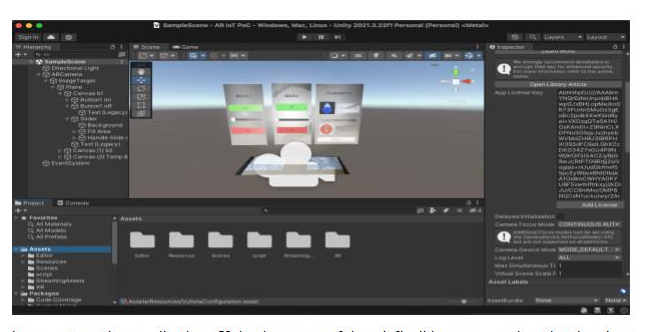
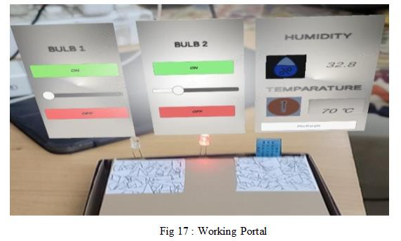

# 🏠 IoT + AR Based Smart Home Automation (6th sem Mini Project)

A smart home automation system using **IoT sensors** with **Blynk** and proposed **Augmented Reality (AR)** control. Monitor temperature/humidity and control appliances via mobile or future AR interface.

## 🔧 Components Used

- ESP8266 NodeMCU  
- DHT11 Temp/Humidity Sensor  
- Relay Module  
- Blynk IoT App  
- Wi-Fi Network

## ⚙️ Features

- 📲 Control light/fan via Blynk sliders  
- 🌡️ Monitor real-time temperature & humidity  
- 💡 Automation ready with motion/temp sensors  
- 🧠 AR interface proposed for future expansion  

## 📲 Blynk Virtual Pins

- `V1`: Fan Speed (PWM)  
- `V3`: Light Intensity (PWM)  
- `V4`: Humidity  
- `V5`: Temperature  

## 📷 Screenshots

> Replace with actual images

  

  

## 🚀 Setup

1. Flash code to ESP8266 using Arduino IDE  
2. Connect to Wi-Fi and Blynk Auth Token  
3. Open Blynk app and link sliders/displays to pins  
4. Watch live sensor data & control appliances remotely  

---

🔮 *Future Scope:* Add AR interface using smartphone AR SDK (e.g., ARCore/ARKit) with gesture/voice control.

